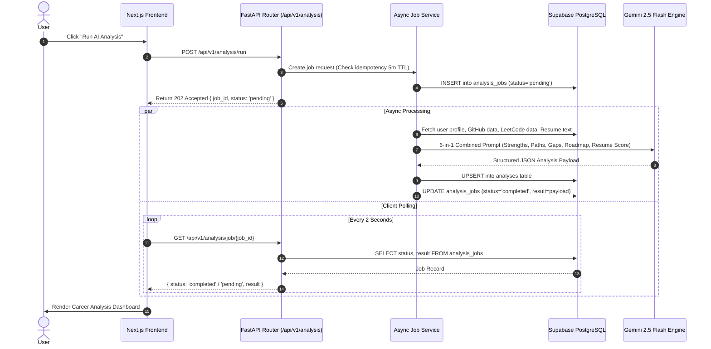
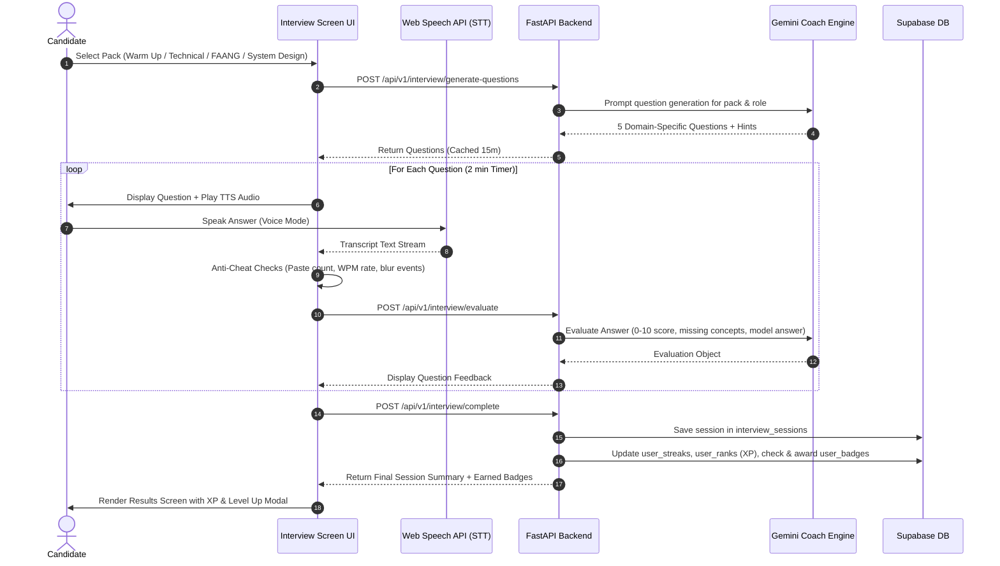
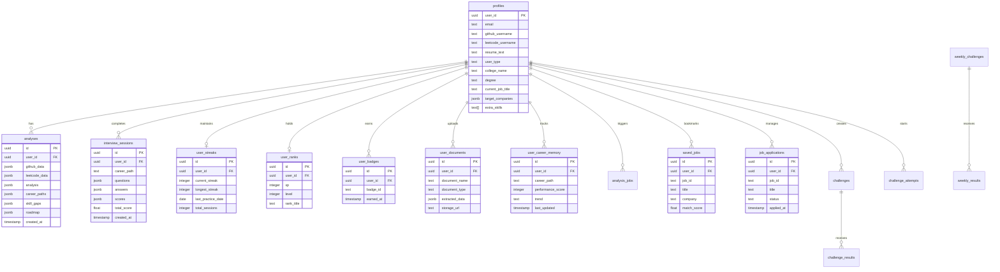

# AI Career Navigator 2026

> **Your Personal AI-Powered Career Mentor & Intelligence Platform** — Built for CS Students, Fresh Graduates & Software Engineers

**AI Career Navigator** is a production-ready, full-stack career intelligence system that ingests **verifiable, multi-source developer profiles** — GitHub repositories, LeetCode contest ratings, uploaded PDF resumes, and AI-extracted certificates — to produce data-driven career paths, skill gap analysis, personalized roadmaps, and real-time voice interview coaching.


## 📸 Platform Interface

| Platform Landing Page | AI Core Capabilities |
|  |

---

## 📑 Table of Contents

1. [Executive Summary](#executive-summary)
2. [System Architecture & Design Patterns](#system-architecture--design-patterns)
3. [Feature Matrix](#feature-matrix)
4. [Data Flow & Sequence Diagrams](#data-flow--sequence-diagrams)
5. [Database Schema & Entity-Relationship Diagram](#database-schema--entity-relationship-diagram)
6. [Project Structure & Codebase Map](#project-structure--codebase-map)
7. [API Reference](#api-reference)
8. [Testing & Verification](#testing--verification)
9. [Getting Started & Local Setup](#getting-started--local-setup)
10. [Environment Configuration](#environment-configuration)
11. [Design System & Frontend Aesthetics](#design-system--frontend-aesthetics)
12. [License](#license)

---

## Executive Summary

Most career platforms rely on self-reported forms susceptible to inflation and outdated data. **AI Career Navigator** eliminates manual forms by directly querying verified third-party developer APIs and extracting structured data from user uploaded files:

- **GitHub REST API Ingestion**: Pulls total repositories, language distributions, star counts, forks, topic tags, and commit velocity.
- **LeetCode GraphQL API Ingestion**: Fetches total problems solved, difficulty breakdown (Easy / Medium / Hard), ranking, and skill tags.
- **PyMuPDF Resume Parsing**: Validates PDF magic bytes (`%PDF-`), extracts raw text, and neutralizes prompt injections before AI processing.
- **AI Certificate Extraction**: Extracts course title, issuer, completion date, unlocked skill tags, and document credibility ratings using Google Gemini.
- **Multi-Source Skill Fusion Matrix**: Combines all ingested signals using confidence-weighted aggregation into a single `CareerBrain` payload.

### Core Metrics

- **Backend Test Suite**: **1,434 passed** tests across 64 test modules (`pytest`).
- **Frontend Unit Suite**: **1,249 passed** tests across 63 test suites (`jest`).
- **Database Architecture**: **16 relational tables** on Supabase PostgreSQL with full Row Level Security (RLS).
- **AI Engine Efficiency**: Single 6-in-1 prompt call structure minimizing latency and API token usage.

---

## System Architecture & Design Patterns


---

## Feature Matrix

### 🧠 Core AI Intelligence


| Feature | Description | Implementation Details |
|---|---|---|
| **Profile Integration Engine** | Fetches live metrics from external developer profiles and documents. | GitHub REST API, LeetCode GraphQL, PyMuPDF PDF parser. |
| **Gemini 2.5 Flash 6-in-1 Call** | Evaluates 6 major career vectors in a single prompt execution to reduce token overhead. | Yields strengths, weaknesses, career paths, skill gaps, 24-week roadmap, and resume score. |
| **Career Brain Engine** | Central aggregator compiling user metrics into a unified job readiness score. | Combines profile data, interview history, streaks, and ranks in `career_brain_service.py`. |
| **Skill Evolution Engine** | Analyzes skill growth trajectory, volatility metrics, and per-role adaptability. | Pattern detection implemented in `career_evolution_engine.py`. |
| **Long-Term Career Memory** | Records historical evaluation sessions to infer stability trends. | Persisted in `user_career_memory` with `improving`, `stable`, or `declining` status. |
| **Multi-Category Skill Extractor** | Normalizes and categorizes extracted skills from raw text and certificates. | Groups skills into Languages, Frameworks, Databases, Tools, and Concepts. |

### 🎙️ AI Interview Coach & Voice Studio


| Feature | Description | Implementation Details |
|---|---|---|
| **4 Interview Packs** | Specialized interview simulations covering different engineering domains. | Warm Up (HR), Technical Round, FAANG Prep (Google/Meta), and System Design. |
| **Voice Input & TTS Engine** | Full hands-free voice answering and question narration. | Web Speech API (`webkitSpeechRecognition` STT + `SpeechSynthesis` TTS). |
| **Per-Question AI Evaluation** | Detailed score breakdown (0–10) with targeted feedback per question. | Analyzes response quality, missing concepts, model answer, and improvement tips. |
| **Anti-Cheat System** | Behavioral telemetry monitoring candidate response integrity. | Monitors paste events, typing speed anomalies (WPM), and window focus shifts. |
| **AI Coach Sidebar** | Real-time panel providing personalized guidance during live sessions. | Displays weakest career path, current job readiness score, and targeted coaching tips. |
| **Simulation Countdown Timer** | Per-question timer with dynamic color alerts and auto-submission. | 2-minute countdown shifting from Blue → Orange → Red (last 30s) → Auto-submit. |

### 🏆 Gamification & Social Challenges


| Feature | Description | Implementation Details |
|---|---|---|
| **Daily Streak System** | Daily practice tracking encouraging consistent preparation habits. | Duolingo-style streak counter with longest streak and freeze tracking in `user_streaks`. |
| **7-Tier XP & Level Progression** | Level progression framework based on accumulated interview and challenge XP. | Levels: 🌱 Fresher → 📚 Beginner → 💼 Junior → ⚡ Mid-level → 🚀 Senior → 👑 Principal → 🏆 Legend. |
| **Automated Badges (12+)** | Automated achievement system awarding badges upon meeting milestone criteria. | Badges: First Step, Perfect Score, Week Warrior, Monthly Legend, Interview Master, Hard Mode Hero, Voice Pro, Weekly Champion, etc. |
| **ISO-Week Challenge Hub** | Weekly interview challenges with live countdown timers and global leaderboards. | Auto-generated per ISO week number with state persistence in `weekly_challenges`. |
| **Peer Challenge Rooms** | Peer-to-peer custom interview challenges via 8-character invite codes. | Create, share, attempt, and compare scores on dedicated challenge leaderboards. |

### 💼 Job Intelligence & Application Pipeline


| Feature | Description | Implementation Details |
|---|---|---|
| **Skill Match Algorithm** | Quantitative matching scoring user skills against job requirements. | Weighted skill vector overlap in `job_matching_service.py`. |
| **Real-Time Job Search** | Real-time software engineering job index integration. | Powered by SerpAPI (Google Jobs) with fallback search URLs for LinkedIn and Internshala. |
| **Job Application Pipeline** | Kanban-style application management tracking application statuses. | Tracks status through `applied` → `interview` → `rejected` → `offer` with custom notes. |
| **Market Demand Analyzer** | Aggregates role-specific market demand metrics and skill trends. | Highlights High Demand, Growing, and Stable skill requirements per role. |

### 📄 Document Processing & Security


| Feature | Description | Implementation Details |
|---|---|---|
| **PDF Magic-Byte Validation** | File validation enforcing strict header checks prior to disk write. | Validates `%PDF-` signature bytes (max 10MB) to block file spoofing. |
| **Certificate AI Parsing** | Automated certificate processing extracting verified metadata. | Supports PDF, JPG, PNG (max 5MB, up to 10 files). Extracts title, provider, score, and skill tags. |
| **Unified Document Schema** | Document repository storing extracted document attributes. | Managed via `user_documents` table with confidence-weighted skill merging. |
| **Prompt Injection Neutralization** | Defense layer scanning input strings before sending queries to Gemini LLM. | Filters 30+ injection patterns (e.g., `ignore previous instructions`, `system prompt override`). |

---

## Data Flow & Sequence Diagrams

### 1. AI Career Analysis Flow (Async Job Queue)



### 2. Live AI Voice Interview Session Flow



---

## Database Schema & Entity-Relationship Diagram

The application uses **Supabase PostgreSQL** containing **16 core tables**, equipped with Row Level Security (RLS) policies and strategic indexing on `user_id` and score fields.



### Table Summary

| Table Name | Primary Purpose | Row Level Security (RLS) | Key Indexes |
|---|---|---|---|
| `profiles` | User contact info, academic details, goals, and social handles | `auth.uid() = user_id` | `user_id`, `github_username`, `leetcode_username` |
| `analyses` | AI career analysis (strengths, gaps, roadmaps) | `auth.uid() = user_id` | `user_id`, `created_at DESC` |
| `interview_sessions` | Logs interview questions, answers, and scores | `auth.uid() = user_id` | `user_id`, `created_at DESC` |
| `user_streaks` | Daily practice streak counter and practice timestamps | `auth.uid() = user_id` | `user_id` (UNIQUE) |
| `user_ranks` | User XP total, progression level (1–7), and rank title | `auth.uid() = user_id` | `user_id` (UNIQUE), `xp DESC` |
| `user_badges` | Record of earned achievement badges | `auth.uid() = user_id` | `user_id`, `(user_id, badge_id)` (UNIQUE) |
| `user_documents` | Certificate & document metadata + extracted skills | `auth.uid() = user_id` | `user_id`, `(user_id, document_type)` |
| `user_career_memory` | Role performance history tracking over time | `auth.uid() = user_id` | `user_id`, `career_path` |
| `analysis_jobs` | Background task tracking for async analysis jobs | `auth.uid() = user_id` | `user_id`, `status` |
| `challenges` | Custom shared peer challenges | Public SELECT, Creator INSERT | `challenge_code` (UNIQUE) |
| `challenge_results` | Results and leaderboards for peer challenges | Public SELECT, Owner INSERT | `challenge_code`, `score DESC` |
| `weekly_challenges` | Global weekly challenge questions per ISO week | Public SELECT, Service Role write | `(week_number, year)` (UNIQUE) |
| `weekly_results` | Submissions for global weekly challenges | Public SELECT, Owner INSERT | `(week_number, year)`, `score DESC` |
| `challenge_attempts` | In-progress attempt markers for weekly challenges | `auth.uid() = user_id` | `(user_id, week_number, year)` (UNIQUE) |
| `saved_jobs` | Bookmarked job listings | `auth.uid() = user_id` | `user_id`, `(user_id, job_id)` (UNIQUE) |
| `job_applications` | Kanban application tracking (`applied` / `interview` / `offer`) | `auth.uid() = user_id` | `user_id`, `status`, `applied_at DESC` |

---

## Project Structure & Codebase Map


---

## API Reference

The backend exposes **30+ REST Endpoints** prefixed with `/api/v1/`, alongside WebSocket and health monitoring routes. Interactive Swagger documentation is available at `/docs`.

### Health & Monitoring

| Endpoint | Method | Auth Required | Description |
|---|---|---|---|
| `/` | GET | No | Returns API version and link to docs |
| `/health` | GET | No | Service status monitor (Database, Gemini, Memory Engine) |
| `/metrics` | GET | No | Application performance metrics (request rates, latency, errors) |
| `/ws` | WS | No | Real-time WebSocket connection for background alerts |

### Authentication & Profile

| Endpoint | Method | Auth Required | Description |
|---|---|---|---|
| `/api/v1/auth/me` | GET | Yes | Retrieve authenticated user metadata |
| `/api/v1/profile/me` | GET | Yes | Get comprehensive user profile details |
| `/api/v1/profile/save` | POST | Yes | Save or update profile attributes |
| `/api/v1/profile/progress` | GET | Yes | Retrieve profile completeness score (0–100) |
| `/api/v1/profile/enhanced` | GET | Yes | Get enhanced profile data including academic and target goals |

### Career Intelligence & Analysis

| Endpoint | Method | Auth Required | Description |
|---|---|---|---|
| `/api/v1/analysis/` | GET | Yes | Fetch active career analysis payload |
| `/api/v1/analysis/run` | POST | Yes | Trigger async AI career analysis job |
| `/api/v1/analysis/job/{job_id}` | GET | Yes | Poll status of an active analysis job |
| `/api/v1/analysis/jobs` | GET | Yes | Retrieve user's historical job executions |
| `/api/v1/career-brain` | GET | Yes | Get unified `CareerBrain` payload (Readiness score, recommendations) |
| `/api/v1/career/evolution/{user_id}` | GET | Yes | Fetch predictive skill trajectory metrics |
| `/api/v1/roadmap/milestone` | PATCH | Yes | Update 24-week roadmap milestone status |

### AI Interview Coach

| Endpoint | Method | Auth Required | Description |
|---|---|---|---|
| `/api/v1/interview/generate-questions` | POST | Yes | Generate role-specific interview questions |
| `/api/v1/interview/evaluate` | POST | Yes | Evaluate candidate response and return feedback |
| `/api/v1/interview/complete` | POST | Yes | Finalize session, calculate XP, and update streaks |
| `/api/v1/interview/question-hint` | POST | Yes | Fetch real-time AI hint for a question |
| `/api/v1/interview/sessions` | GET | Yes | Retrieve candidate's interview session history |

### Job Intelligence & Application Tracking

| Endpoint | Method | Auth Required | Description |
|---|---|---|---|
| `/api/v1/jobs/recommendations` | GET | Yes | Fetch skill-matched job recommendations |
| `/api/v1/jobs/search` | GET | Yes | Search live jobs via SerpAPI (Google Jobs) |
| `/api/v1/jobs/save` | POST | Yes | Bookmark job listing |
| `/api/v1/jobs/saved` | GET | Yes | List saved job bookmarks |
| `/api/v1/jobs/apply` | POST | Yes | Create job application entry |
| `/api/v1/jobs/applications` | GET | Yes | Get job application pipeline entries |

### Document Processing

| Endpoint | Method | Auth Required | Description |
|---|---|---|---|
| `/api/v1/resume/upload` | POST | Yes | Upload PDF resume with magic-byte validation (max 10MB) |
| `/api/v1/resume/status/{user_id}` | GET | Yes | Get status of processed resume |
| `/api/v1/documents/upload-files` | POST | Yes | Upload and parse certificates (PDF/JPG/PNG, max 5MB) |
| `/api/v1/documents/list` | GET | Yes | List user documents |
| `/api/v1/documents/{id}` | DELETE | Yes | Remove document entry |

### Gamification & Challenges

| Endpoint | Method | Auth Required | Description |
|---|---|---|---|
| `/api/v1/streaks/{user_id}` | GET | Yes | Get user practice streak statistics |
| `/api/v1/ranks/{user_id}` | GET | Yes | Retrieve XP total, level, and rank title |
| `/api/v1/badges/{user_id}` | GET | Yes | List earned achievement badges |
| `/api/v1/challenges/create` | POST | Yes | Create peer-to-peer challenge room |
| `/api/v1/challenges/{code}` | GET | Yes | Fetch custom challenge questions by code |
| `/api/v1/challenges/{code}/submit` | POST | Yes | Submit responses for peer challenge room |
| `/api/v1/weekly-challenge/current` | GET | Yes | Get current ISO week challenge |
| `/api/v1/weekly-challenge/submit` | POST | Yes | Submit ISO week challenge attempt |
| `/api/v1/weekly-challenge/leaderboard` | GET | Yes | View global weekly challenge leaderboard |

---

## Testing & Verification

The repository enforces strict quality standards through multi-layered automated test suites.

### Backend Test Suite (`pytest`)

Execution command:
```bash
cd backend
.\venv\Scripts\pytest
```

- **Total Tests Passed**: **1,434 tests** (0 failures).
- **Test Modules**: **64 test files** across unit, router, integration, and security layers.
- **Coverage Areas**:
  - `test_api_endpoints.py`: Router status codes and contract payloads.
  - `test_auth.py` & `test_auth_router.py`: Supabase JWT verification and RBAC middleware.
  - `test_badge_service.py` & `test_badges.py`: Event-driven badge verification.
  - `test_career_brain_service.py`: Decision aggregation correctness.
  - `test_file_validation.py`: PDF magic-byte checks and upload bounds.
  - `test_input_sanitization.py`: Prompt injection detection (30+ malicious test vectors).
  - `test_gemini_service_coverage.py`: Transport retries and rate-limit backoff logic.
  - `test_job_matching_service.py`: TF-IDF skill matching algorithms.

### Frontend Unit & Component Suite (`jest`)

Execution command:
```bash
cd frontend
pnpm test
```

- **Unit & Component Tests Passed**: **1,249 tests** across **63 test suites**.
- **Coverage Areas**: Component rendering, custom hooks (`useInterviewSession`, `useVoiceInput`, `useSimTimer`), Orchestrator state logic, and safe accessor utility functions.

---

## Getting Started & Local Setup

### Prerequisites

- **Node.js**: v18.0.0 or higher
- **pnpm**: v8.0.0 or higher
- **Python**: v3.10 or higher
- **Supabase Account**: Project URL, Service Role Key, and Anon Key
- **Google Gemini API Key**: API key from Google AI Studio (`gemini-2.5-flash`)

---

### 1. Repository Setup

```bash
git clone https://github.com/shivam499-pro/AI-CAREER-NAVIGATOR-2026.git
cd AI-CAREER-NAVIGATOR-2026
```

---

### 2. Frontend Installation & Execution

```bash
cd frontend
pnpm install
```

Create `.env.local` in `frontend/`:
```env
NEXT_PUBLIC_SUPABASE_URL=https://your-supabase-project.supabase.co
NEXT_PUBLIC_SUPABASE_ANON_KEY=your-supabase-anon-key
NEXT_PUBLIC_API_URL=http://localhost:8000
```

Start the Next.js development server:
```bash
pnpm dev
```
Access frontend at **`http://localhost:3000`**

---

### 3. Backend Setup & Execution

```bash
cd backend
python -m venv venv

# Windows:
venv\Scripts\activate

# macOS / Linux:
source venv/bin/activate

pip install -r requirements.txt
```

Create `.env` in `backend/`:
```env
SUPABASE_URL=https://your-supabase-project.supabase.co
SUPABASE_SERVICE_KEY=your-supabase-service-role-key
SUPABASE_ANON_KEY=your-supabase-anon-key
GEMINI_API_KEY=your-google-gemini-api-key
CORS_ORIGINS=http://localhost:3000
```

Start the FastAPI application:
```bash
python main.py
```
Access backend API documentation at **`http://localhost:8000/docs`**

---

### 4. Database Setup

1. Open your Supabase Project Dashboard -> **SQL Editor**.
2. Copy the entire contents of [`backend/schema.sql`](backend/schema.sql).
3. Execute the script to instantiate all 16 tables, indexes, and Row Level Security policies.

---

## Environment Configuration

### Required Variables

| Variable Name | Component | Description |
|---|---|---|
| `SUPABASE_URL` | Backend & Frontend | Your Supabase project HTTP URL |
| `SUPABASE_SERVICE_KEY` | Backend Only | Supabase admin service role key (Never expose to frontend) |
| `SUPABASE_ANON_KEY` | Backend & Frontend | Supabase public anonymous key |
| `GEMINI_API_KEY` | Backend Only | Google AI Studio API Key for Gemini 2.5 Flash |

### Optional Variables

| Variable Name | Component | Default Value | Description |
|---|---|---|---|
| `GITHUB_TOKEN` | Backend | `None` | GitHub Personal Access Token (Raises rate limit from 60 to 5000 req/hr) |
| `SERPAPI_KEY` | Backend | `None` | SerpAPI Key enabling real-time Google Jobs search |
| `GMAIL_USER` | Backend | `None` | Sender Gmail address for weekly AI summary email reports |
| `GMAIL_APP_PASSWORD` | Backend | `None` | Gmail App Password for SMTP authentication |
| `CORS_ORIGINS` | Backend | `http://localhost:3000` | Comma-separated list of allowed CORS origins |
| `REDIS_URL` | Backend | `redis://localhost:6379/0` | Connection string for Redis caching (Falls back to in-memory) |

---

## Design System & Frontend Aesthetics

The frontend interface incorporates modern design principles to provide an engaging user experience:

- **Tailwind CSS Styling**: Custom color palette utilizing Deep Navy (`#0F172A`), Electric Violet (`#6C3FC8`), Success Emerald (`#22C55E`), and Accent Blue (`#2E6CB8`).
- **Glassmorphism**: Subtle translucent background layers (`bg-slate-900/30`, `backdrop-blur-md`, `border-white/5`).
- **Smooth Animations**: Powered by `framer-motion` for page transitions, tab switches, and badge unlocking feedback.
- **Interactive Visualizations**: Data rendering using `recharts` for progress tracking, skill gap comparisons, and radar readiness metrics.

---

## License

This project is open-source software licensed under the **MIT License**.
