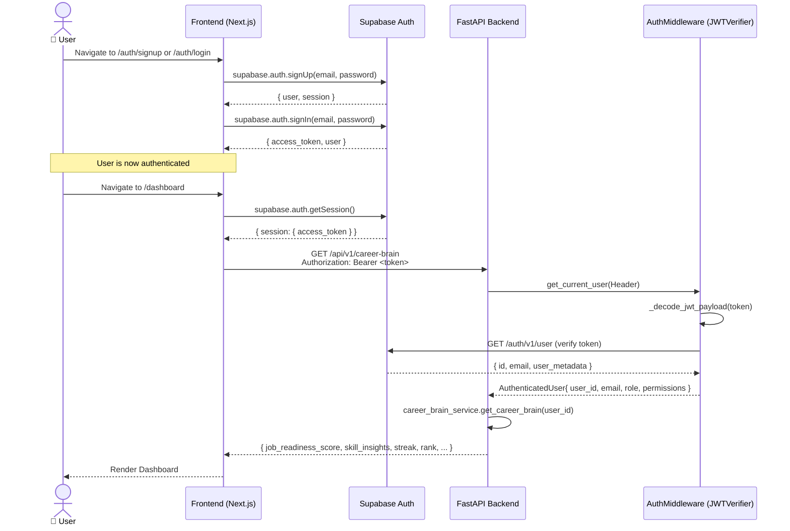
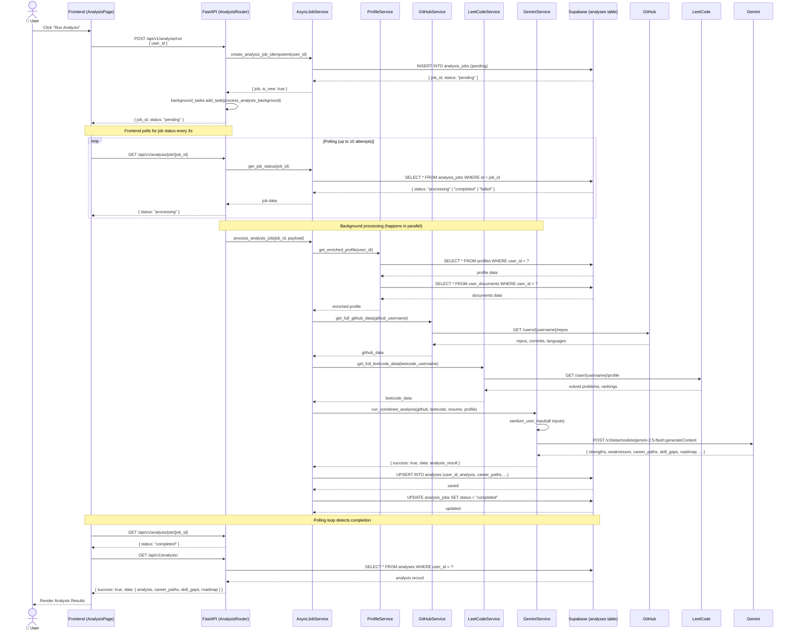
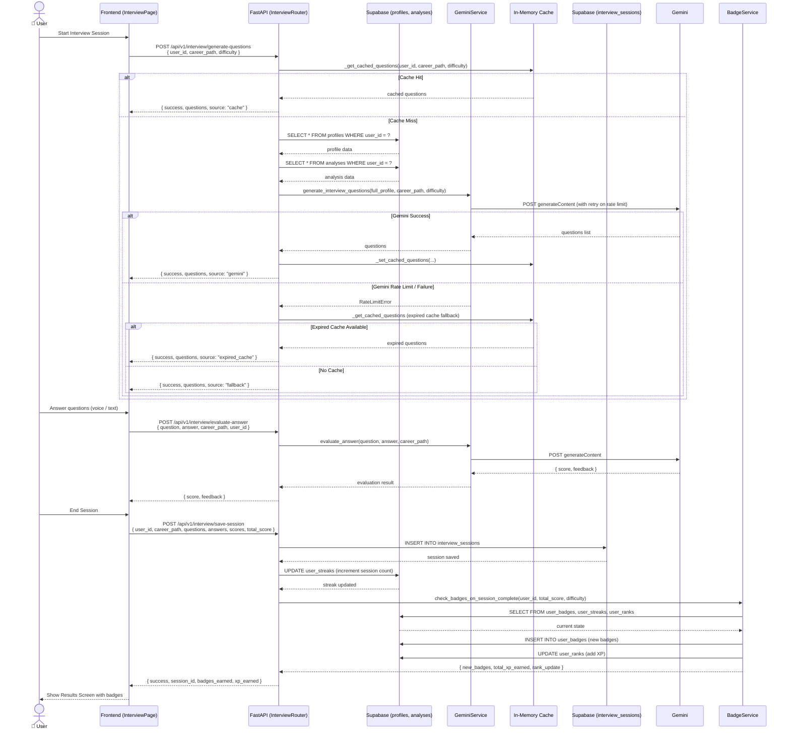
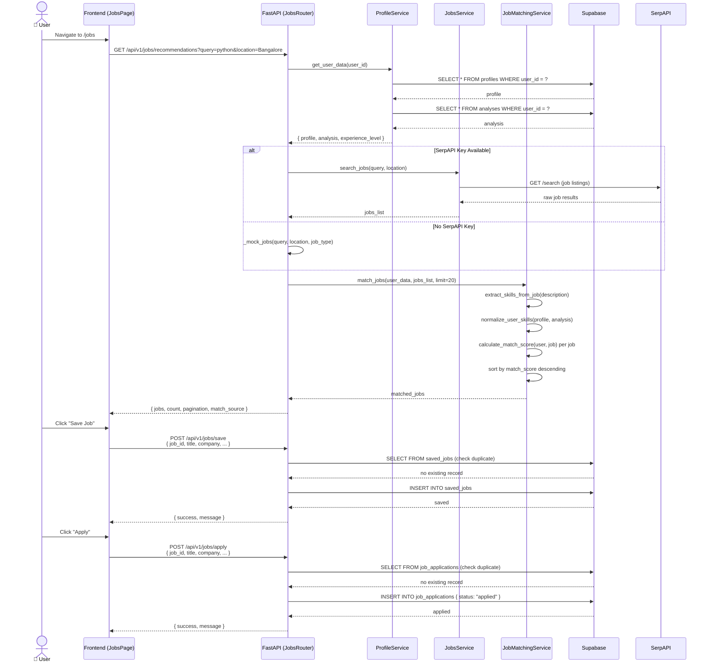
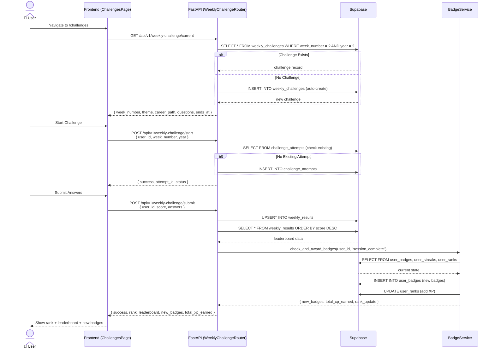

# AI Career Navigator — UML Diagrams

> **Project:** AI Career Navigator
> **Tech Stack:** FastAPI (Backend) · Next.js (Frontend) · Supabase (Database) · Google Gemini AI
> **Scope:** Read-only analysis — no code modifications made.

---

## 1. Use Case Diagram

```mermaid
usecaseDiagram
    actor User as "👤 User\n(Student / Professional)"
    actor Admin as "🔧 Admin"
    actor GitHub as "🐙 GitHub API"
    actor LeetCode as "💻 LeetCode API"
    actor Gemini as "🤖 Gemini AI"
    actor Supabase as "🗄️ Supabase DB"
    actor SerpAPI as "🔍 SerpAPI"

    package "AI Career Navigator" {
        usecase "UC-01\nSign Up / Login" as UC01
        usecase "UC-02\nCreate / Edit Profile" as UC02
        usecase "UC-03\nUpload Resume" as UC03
        usecase "UC-04\nConnect GitHub" as UC04
        usecase "UC-05\nConnect LeetCode" as UC05
        usecase "UC-06\nRun AI Career Analysis" as UC06
        usecase "UC-07\nView Career Paths" as UC07
        usecase "UC-08\nView Skill Gaps" as UC08
        usecase "UC-09\nView Resume Score" as UC09
        usecase "UC-10\nGenerate Interview Questions" as UC10
        usecase "UC-11\nAnswer Interview Questions" as UC11
        usecase "UC-12\nEvaluate Interview Answers" as UC12
        usecase "UC-13\nSave Interview Session" as UC13
        usecase "UC-14\nGet Job Recommendations" as UC14
        usecase "UC-15\nSave Job" as UC15
        usecase "UC-16\nApply to Job" as UC16
        usecase "UC-17\nTrack Applications" as UC17
        usecase "UC-18\nView Career Roadmap" as UC18
        usecase "UC-19\nUpdate Milestone" as UC19
        usecase "UC-20\nUpload Certificates" as UC20
        usecase "UC-21\nView Streaks & XP" as UC21
        usecase "UC-22\nEarn Badges" as UC22
        usecase "UC-23\nWeekly Challenge" as UC23
        usecase "UC-24\nView Career Brain" as UC24
        usecase "UC-25\nManage Documents" as UC25
    }

    %% Authentication
    User --> UC01
    Admin --> UC01

    %% Profile Management
    User --> UC02
    User --> UC03
    User --> UC04
    User --> UC05
    User --> UC20
    User --> UC25

    %% Analysis
    User --> UC06
    User --> UC07
    User --> UC08
    User --> UC09
    User --> UC24

    %% Interview
    User --> UC10
    User --> UC11
    User --> UC12
    User --> UC13

    %% Jobs
    User --> UC14
    User --> UC15
    User --> UC16
    User --> UC17

    %% Roadmap
    User --> UC18
    User --> UC19

    %% Gamification
    User --> UC21
    User --> UC22
    User --> UC23

    %% External system relationships
    UC04 --> GitHub : "fetch repos & activity"
    UC05 --> LeetCode : "fetch solved problems"
    UC06 --> Gemini : "AI analysis request"
    UC10 --> Gemini : "generate questions"
    UC12 --> Gemini : "evaluate answers"
    UC14 --> SerpAPI : "search jobs"
    UC06 --> Supabase : "save analysis"
    UC13 --> Supabase : "save session"
    UC15 --> Supabase : "save job"
    UC16 --> Supabase : "save application"
    UC21 --> Supabase : "read streak/rank"
    UC22 --> Supabase : "award badge"
    UC23 --> Supabase : "submit challenge"
```

---

## 2. UML Class Diagram

```mermaid
classDiagram
    %% ===================== FRONTEND LAYER =====================
    namespace Frontend {
        class HomePage {
            +render() void
        }
        class DashboardPage {
            -user: User
            -brain: CareerBrainData
            -analysisSummary: AnalysisSummary
            -appStats: AppStats
            +loadCareerBrain() async
            +loadAppStats() async
            +loadAnalysisSummary() async
        }
        class AnalysisPage {
            -analysis: AnalysisData
            -selectedPath: string
            -pathDetails: Record
            -roadmapProgress: Record
            +runAnalysis(userId) async
            +checkExistingAnalysis(userId) async
            +updateMilestone(week, status) async
            +fetchRoadmapProgress(careerPath) async
        }
        class InterviewPage {
            -questions: Question[]
            -answers: Answer[]
            -scores: Score[]
            -sessionActive: boolean
            +generateQuestions() async
            +submitAnswer() async
            +endSession() async
        }
        class ProfilePage {
            -profile: ProfileData
            -completeness: number
            +saveProfile(data) async
            +uploadResume(file) async
        }
        class JobsPage {
            -jobs: Job[]
            -applications: Application[]
            +getRecommendations() async
            +saveJob(job) async
            +applyToJob(job) async
        }
        class BadgesPage {
            -earnedBadges: Badge[]
            -allBadges: Badge[]
            +loadBadges() async
        }
        class ChallengesPage {
            -currentChallenge: Challenge
            -leaderboard: LeaderboardEntry[]
            +loadChallenge() async
            +submitChallenge(score) async
        }

        class ApiClient {
            -supabase: SupabaseClient
            -API_URL: string
            +getProfile() Promise~EnrichedProfile~
            +saveProfile(data) Promise
            +runAnalysis() Promise
            +getJobRecommendations(params) Promise
            +uploadDocument(data) Promise
            +getDocuments(type) Promise
            +requestWithRetry(endpoint, retries) Promise
        }

        class Navbar {
            +render() void
        }
        class ProgressTracker {
            -progress: UserProgress
            +render() void
        }
        class CareerCoach {
            -recommendations: string[]
            +render() void
        }
        class MatchFitScore {
            -score: number
            -label: string
            +render() void
        }
        class CareerRoadmap {
            -milestones: Milestone[]
            -progress: Record
            +render() void
        }
    }

    %% ===================== BACKEND LAYER =====================
    namespace Backend {
        class FastAPIApp {
            +title: string
            +version: string
            +include_router(router, prefix) void
            +add_middleware(middleware) void
            +exception_handler(exc) void
        }

        class AuthRouter {
            +POST /signup
            +POST /login
            +GET /me
        }

        class AnalysisRouter {
            +GET /analysis/
            +POST /analysis/run
            +GET /analysis/job/{job_id}
            +GET /analysis/jobs
            +GET /analysis/career-paths
            +GET /analysis/skill-gap
        }

        class ProfileRouter {
            +GET /profile/me
            +POST /profile/save
            +GET /profile/progress
            +GET /profile/match-fit
        }

        class InterviewRouter {
            +POST /generate-questions
            +POST /evaluate-answer
            +POST /save-session
            +GET /hint
        }

        class JobsRouter {
            +GET /jobs/recommendations
            +GET /jobs/applications
            +POST /jobs/save
            +POST /jobs/apply
        }

        class ResumeRouter {
            +POST /resume/upload
            +GET /resume/status/{user_id}
        }

        class DocumentsRouter {
            +POST /documents/upload-files
            +GET /documents/list
            +GET /documents/{id}
            +DELETE /documents/{id}
        }

        class RoadmapRouter {
            +PATCH /roadmap/milestone
            +GET /roadmap/progress/{career_path}
        }

        class StreaksRouter {
            +GET /streaks/{user_id}
            +POST /streaks/update
        }

        class BadgesRouter {
            +GET /badges/{user_id}
            +POST /badges/check
        }

        class WeeklyChallengeRouter {
            +GET /weekly-challenge/current
            +POST /weekly-challenge/submit
            +GET /weekly-challenge/leaderboard
            +POST /weekly-challenge/start
        }

        class CareerBrainRouter {
            +GET /career-brain
        }

        class GeminiService {
            +GEMINI_API_KEY: string
            +MOCK_MODE: bool
            +run_combined_analysis(github, leetcode, resume, profile) dict
            +generate_interview_questions(profile, career_path, difficulty) list
            +evaluate_answer(question, answer, career_path) dict
            +analyze_certificate(file_content, filename, mime_type) dict
            +sanitize_user_input(text) string
        }

        class AnalysisService {
            +get_analysis_by_user_id(user_id) dict
            +save_analysis(user_id, data) bool
            +run_analysis(user_id) async dict
            +get_career_recommendations(user_id) list
            +get_skill_gaps(user_id) list
        }

        class ProfileService {
            +get_profile_by_user_id(user_id) dict
            +save_profile(user_id, data) bool
            +get_enriched_profile(user_id) dict
            +merge_skills_from_documents(user_id) list
            +calculate_profile_completeness(profile) int
            +get_user_progress(user_id) dict
        }

        class ResumeService {
            +extract_text(file_path) string
            +extract_skills(text) list
            +extract_experience(text) list
        }

        class JobMatchingService {
            +TECH_SKILLS: set
            +match_jobs(user, jobs, limit) list
            +calculate_match_score(user, job) dict
            +extract_skills_from_job(description) list
            +normalize_user_skills(profile, analysis) list
        }

        class BadgeService {
            +BADGES: dict
            +check_and_award_badges(user_id, event, event_data) dict
            +check_badges_on_session_complete(user_id, score, difficulty) dict
            +award_badge(user_id, badge_id) dict
            +add_xp_to_user(user_id, xp) dict
            +calculate_level(xp) int
        }

        class CareerBrainService {
            +get_career_brain(user_id) async dict
            +analyze_skills(profile, analysis, applications) dict
            +calculate_job_readiness_score(profile, analysis, apps, sessions) float
            +generate_behavioral_insights(applications, sessions, streak) list
            +generate_recommendations(skills, readiness, apps) list
            +detect_risks(applications, sessions, streak) list
        }

        class DocumentService {
            +get_user_documents(user_id) list
            +get_documents_by_type(user_id, doc_type) list
            +get_document_by_id(doc_id) dict
            +delete_document(doc_id, user_id) bool
        }

        class JobsService {
            +search_jobs(query, location) async list
        }

        class GitHubService {
            +get_full_github_data(username) async dict
        }

        class LeetCodeService {
            +get_full_leetcode_data(username) async dict
        }

        class AsyncJobService {
            +create_analysis_job_idempotent(user_id, window) tuple
            +get_job_status(job_id) dict
            +get_user_job_history(user_id) list
            +process_analysis_job(job_id, payload) async
        }

        class JWTVerifier {
            +supabase_url: string
            +verify_token(authorization) AuthenticatedUser
            +_decode_jwt_payload(token) dict
            +_verify_supabase_token(token) AuthenticatedUser
            +invalidate_user_cache(user_id) void
        }

        class AuthenticatedUser {
            +user_id: string
            +email: string
            +role: string
            +permissions: List~string~
            +has_permission(permission) bool
        }

        class APIResponse {
            +success: bool
            +data: Any
            +error: string
            +meta: dict
            +success_response(data, message) dict
            +error_response(error, code) dict
        }

        class Settings {
            +SUPABASE_URL: string
            +SUPABASE_SERVICE_KEY: string
            +GEMINI_API_KEY: string
            +GITHUB_TOKEN: string
            +SERPAPI_KEY: string
            +get_supabase_url() string
            +is_production() bool
        }

        class RateLimitError {
            +message: string
        }
    }

    %% ===================== DATABASE LAYER =====================
    namespace Database {
        class profiles {
            +user_id: UUID PK
            +email: TEXT
            +github_username: TEXT
            +leetcode_username: TEXT
            +linkedin_url: TEXT
            +resume_text: TEXT
            +resume_filename: TEXT
            +resume_url: TEXT
            +college_name: TEXT
            +degree: TEXT
            +branch: TEXT
            +year_of_study: TEXT
            +graduation_year: INTEGER
            +cgpa: TEXT
            +user_type: TEXT
            +current_job_title: TEXT
            +current_company: TEXT
            +years_of_experience: INTEGER
            +current_tech_stack: JSONB
            +career_goal: TEXT
            +extra_skills: TEXT[]
            +certificates: TEXT[]
            +created_at: TIMESTAMPTZ
            +updated_at: TIMESTAMPTZ
        }

        class analyses {
            +id: UUID PK
            +user_id: UUID FK
            +github_data: JSONB
            +leetcode_data: JSONB
            +analysis: JSONB
            +career_paths: JSONB
            +skill_gaps: JSONB
            +roadmap: JSONB
            +experience_level: TEXT
            +strengths: TEXT[]
            +weaknesses: TEXT[]
            +resume_score: JSONB
            +salary_insights: JSONB
            +top_companies: JSONB
            +certifications: JSONB
            +created_at: TIMESTAMPTZ
            +updated_at: TIMESTAMPTZ
        }

        class interview_sessions {
            +id: UUID PK
            +user_id: UUID FK
            +career_path: TEXT
            +questions: JSONB
            +answers: JSONB
            +scores: JSONB
            +total_score: FLOAT
            +created_at: TIMESTAMPTZ
        }

        class user_streaks {
            +id: UUID PK
            +user_id: UUID FK
            +current_streak: INTEGER
            +longest_streak: INTEGER
            +last_practice_date: DATE
            +total_sessions: INTEGER
            +created_at: TIMESTAMPTZ
            +updated_at: TIMESTAMPTZ
        }

        class user_ranks {
            +id: UUID PK
            +user_id: UUID FK
            +xp: INTEGER
            +level: INTEGER
            +rank_title: TEXT
            +created_at: TIMESTAMPTZ
            +updated_at: TIMESTAMPTZ
        }

        class user_badges {
            +id: UUID PK
            +user_id: UUID FK
            +badge_id: TEXT
            +earned_at: TIMESTAMPTZ
        }

        class user_documents {
            +id: UUID PK
            +user_id: UUID FK
            +document_name: TEXT
            +document_type: TEXT
            +extracted_data: JSONB
            +storage_url: TEXT
            +created_at: TIMESTAMPTZ
        }

        class job_applications {
            +id: UUID PK
            +user_id: UUID FK
            +job_id: TEXT
            +title: TEXT
            +company: TEXT
            +status: TEXT
            +match_score: FLOAT
            +applied_at: TIMESTAMPTZ
        }

        class saved_jobs {
            +id: UUID PK
            +user_id: UUID FK
            +job_id: TEXT
            +title: TEXT
            +company: TEXT
            +match_score: FLOAT
            +saved_at: TIMESTAMPTZ
        }

        class challenges {
            +id: UUID PK
            +challenge_code: TEXT
            +creator_id: UUID FK
            +career_path: TEXT
            +questions: JSONB
            +created_at: TIMESTAMPTZ
        }

        class challenge_results {
            +id: UUID PK
            +challenge_code: TEXT
            +user_id: UUID FK
            +score: FLOAT
            +answers: JSONB
            +completed_at: TIMESTAMPTZ
        }

        class weekly_challenges {
            +id: UUID PK
            +week_number: INTEGER
            +year: INTEGER
            +career_path: TEXT
            +questions: JSONB
            +creator_id: UUID FK
            +created_at: TIMESTAMPTZ
        }

        class weekly_results {
            +id: UUID PK
            +user_id: UUID FK
            +week_number: INTEGER
            +year: INTEGER
            +score: FLOAT
            +answers: JSONB
            +completed_at: TIMESTAMPTZ
        }

        class roadmap_progress {
            +id: UUID PK
            +user_id: UUID FK
            +career_path: TEXT
            +milestone_week: INTEGER
            +status: TEXT
            +notes: TEXT
            +completed_at: TIMESTAMPTZ
            +updated_at: TIMESTAMPTZ
        }

        class analysis_jobs {
            +id: UUID PK
            +job_type: TEXT
            +user_id: UUID FK
            +status: TEXT
            +payload: JSONB
            +result: JSONB
            +error_message: TEXT
            +created_at: TIMESTAMPTZ
        }

        class user_career_memory {
            +id: UUID PK
            +user_id: UUID FK
            +career_path: TEXT
            +skill_area: TEXT
            +performance_score: INTEGER
            +confidence_score: FLOAT
            +trend: TEXT
            +session_count: INTEGER
            +last_updated: TIMESTAMPTZ
        }
    }

    %% ===================== RELATIONSHIPS =====================

    %% Frontend -> Backend (API calls)
    DashboardPage --> ApiClient : uses
    AnalysisPage --> ApiClient : uses
    InterviewPage --> ApiClient : uses
    ProfilePage --> ApiClient : uses
    JobsPage --> ApiClient : uses
    BadgesPage --> ApiClient : uses
    ChallengesPage --> ApiClient : uses

    %% FastAPI -> Routers
    FastAPIApp --> AuthRouter : includes
    FastAPIApp --> AnalysisRouter : includes
    FastAPIApp --> ProfileRouter : includes
    FastAPIApp --> InterviewRouter : includes
    FastAPIApp --> JobsRouter : includes
    FastAPIApp --> ResumeRouter : includes
    FastAPIApp --> DocumentsRouter : includes
    FastAPIApp --> RoadmapRouter : includes
    FastAPIApp --> StreaksRouter : includes
    FastAPIApp --> BadgesRouter : includes
    FastAPIApp --> WeeklyChallengeRouter : includes
    FastAPIApp --> CareerBrainRouter : includes

    %% Middleware
    FastAPIApp --> JWTVerifier : uses
    JWTVerifier --> AuthenticatedUser : creates
    AnalysisRouter --> AuthenticatedUser : depends on
    ProfileRouter --> AuthenticatedUser : depends on
    InterviewRouter --> AuthenticatedUser : depends on
    JobsRouter --> AuthenticatedUser : depends on

    %% Routers -> Services
    AnalysisRouter --> AnalysisService : calls
    AnalysisRouter --> AsyncJobService : calls
    ProfileRouter --> ProfileService : calls
    InterviewRouter --> GeminiService : calls
    JobsRouter --> JobMatchingService : calls
    JobsRouter --> JobsService : calls
    ResumeRouter --> ResumeService : calls
    ResumeRouter --> GeminiService : calls
    DocumentsRouter --> DocumentService : calls
    DocumentsRouter --> GeminiService : calls
    StreaksRouter --> Supabase : calls
    BadgesRouter --> BadgeService : calls
    BadgesRouter --> Supabase : calls
    WeeklyChallengeRouter --> Supabase : calls
    WeeklyChallengeRouter --> BadgeService : calls
    CareerBrainRouter --> CareerBrainService : calls

    %% Service -> Service dependencies
    AnalysisService --> ProfileService : uses
    AnalysisService --> GitHubService : uses
    AnalysisService --> LeetCodeService : uses
    AnalysisService --> GeminiService : uses
    JobMatchingService --> ProfileService : uses
    CareerBrainService --> Supabase : calls

    %% Services -> Database
    AnalysisService --> profiles : reads/writes
    AnalysisService --> analyses : reads/writes
    ProfileService --> profiles : reads/writes
    ProfileService --> user_documents : reads
    ResumeRouter --> profiles : reads/writes
    ResumeRouter --> user_documents : writes
    InterviewRouter --> profiles : reads
    InterviewRouter --> analyses : reads
    JobsRouter --> profiles : reads
    JobsRouter --> analyses : reads
    JobsRouter --> job_applications : reads/writes
    JobsRouter --> saved_jobs : reads/writes
    StreaksRouter --> user_streaks : reads/writes
    BadgesRouter --> user_badges : reads/writes
    BadgesRouter --> user_streaks : reads
    BadgesRouter --> user_ranks : reads/writes
    BadgesRouter --> challenges : reads
    WeeklyChallengeRouter --> weekly_challenges : reads/writes
    WeeklyChallengeRouter --> weekly_results : reads/writes
    WeeklyChallengeRouter --> challenge_attempts : reads/writes
    RoadmapRouter --> roadmap_progress : reads/writes
    DocumentsRouter --> user_documents : reads/writes
    CareerBrainService --> profiles : reads
    CareerBrainService --> analyses : reads
    CareerBrainService --> interview_sessions : reads
    CareerBrainService --> job_applications : reads
    CareerBrainService --> saved_jobs : reads
    CareerBrainService --> user_streaks : reads
    CareerBrainService --> user_ranks : reads

    %% GeminiService -> External AI
    GeminiService --> Gemini : "Google Gemini 2.5 Flash API"

    %% JobsService -> External API
    JobsService --> SerpAPI : "job search"

    %% GitHub/LeetCode -> External APIs
    GitHubService --> GitHub : "fetch repos, commits, languages"
    LeetCodeService --> LeetCode : "fetch solved problems, rankings"

    %% BadgeService -> Database
    BadgeService --> user_badges : writes
    BadgeService --> user_ranks : reads/writes
    BadgeService --> user_streaks : reads
    BadgeService --> challenges : reads

    %% Inheritance / Enum
    class UserRole {
        <<enumeration>>
        ADMIN
        USER
        GUEST
        PREMIUM
    }
    class Permission {
        <<enumeration>>
        READ_PROFILE
        WRITE_PROFILE
        READ_ANALYSIS
        WRITE_ANALYSIS
        READ_JOBS
        WRITE_JOBS
        READ_RESUME
        WRITE_RESUME
        READ_INTERVIEW
        WRITE_INTERVIEW
        READ_DOCUMENTS
        WRITE_DOCUMENTS
        ADMIN_ACCESS
    }
    AuthenticatedUser --> UserRole : has
    AuthenticatedUser --> Permission : has
```

---

## 3. UML Sequential Diagrams

### 3.1 — User Authentication Flow



---

### 3.2 — AI Career Analysis Flow (Async Job)



---

### 3.3 — Interview Session Flow



---

### 3.4 — Job Matching & Application Flow



---

### 3.5 — Weekly Challenge Flow



---

## Diagram Index

| # | Diagram | Description |
|---|---------|-------------|
| 1 | **Use Case Diagram** | 25 use cases across 7 feature domains, 3 actor types, and 6 external system integrations |
| 2 | **UML Class Diagram** | 3-layer architecture: Frontend (7 pages + 5 components + ApiClient), Backend (13 routers + 10 services + 5 core classes), Database (14 tables) |
| 3.1 | **Auth Sequence** | Supabase JWT-based authentication with middleware verification |
| 3.2 | **Analysis Sequence** | Async job pattern: create → poll → background process → Gemini AI → save |
| 3.3 | **Interview Sequence** | Cache-first question generation with Gemini fallback chain + badge awarding |
| 3.4 | **Job Matching Sequence** | Profile aggregation → SerpAPI/mock → AI matching → save/apply |
| 3.5 | **Weekly Challenge Sequence** | Auto-create challenge → start attempt → submit → leaderboard → badge/XP |
